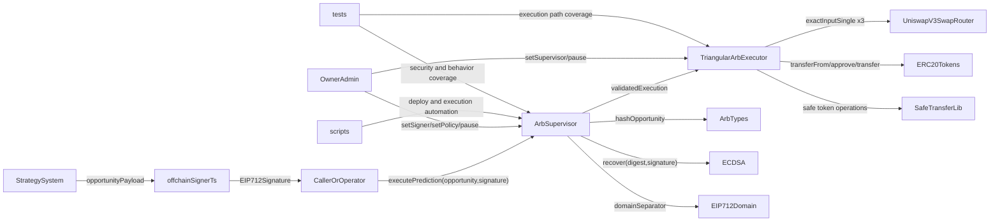

# Sample Uniswap Flash Loans

Author: Zachary King - github.com/zacharyericking/sample_uniswap_flash_loans

This repository is used for triangular arbitrage on Uniswap v3 using off-chain alpha signals
powered by AI, ML, and statistical learning. Those signals identify candidate opportunities and
trigger supervisor-mediated on-chain execution through signed predictions.

Objective: secure, signature-gated triangular arbitrage execution on Polygon and Arbitrum using
an off-chain signer and an on-chain supervisor/executor split.

## Uniswap v3 Fee Levels (Layperson Explanation)

Uniswap v3 lets the same token pair exist in multiple pools with different fee levels. The standard
v3 fee levels are 0.01%, 0.05%, 0.30%, and 1.00%
([Uniswap Docs: Fees](https://docs.uniswap.org/concepts/protocol/fees)).

In plain terms, lower-fee pools are usually better for pairs that move less (like stablecoins),
while higher-fee pools are common for assets that move more because liquidity providers take more
risk and want higher compensation
([Uniswap Docs: Fees](https://docs.uniswap.org/concepts/protocol/fees)).

Uniswap v3 also uses concentrated liquidity, where liquidity is provided in specific price ranges,
which can make available liquidity differ by pool and time
([Uniswap Docs: Concentrated Liquidity](https://docs.uniswap.org/concepts/protocol/concentrated-liquidity)).

Because one token pair can have several fee-tier pools and liquidity can be distributed differently,
temporary price differences can appear across routes. A triangular arbitrage strategy tries to
capture these short-lived differences, but a trade is only worth taking if net profit remains
positive after fees, slippage, and gas.

## Repository Module Index

| Module            | Primary Responsibility                                 | Key Files                                                                |
| ----------------- | ------------------------------------------------------ | ------------------------------------------------------------------------ |
| `src/`            | Production arbitrage supervision and execution logic   | `ArbSupervisor.sol`, `TriangularArbExecutor.sol`, `ArbTypes.sol`         |
| `src/libraries/`  | Signature, typed-data, and token safety primitives     | `ECDSA.sol`, `EIP712Domain.sol`, `SafeTransferLib.sol`                   |
| `src/utils/`      | Access control, pause, and reentrancy protections      | `Ownable.sol`, `Pausable.sol`, `ReentrancyGuard.sol`                     |
| `src/interfaces/` | External protocol/token interfaces                     | `IERC20.sol`, `ISwapRouter.sol`                                          |
| `script/`         | Deployment and signed-opportunity execution automation | `DeployPolygon.s.sol`, `DeployArbitrum.s.sol`, `ExecutePrediction.s.sol` |
| `offchain/`       | EIP-712 opportunity signing pipeline                   | `signOpportunity.ts`                                                     |
| `test/`           | Security and behavioral verification                   | `ArbSupervisor.t.sol`, `TriangularArbExecutor.t.sol`, mocks              |

## Relationship Map

## Supervisor-Operated Execution Flow

1. Strategy system produces a triangular opportunity candidate.
2. Authorized signer creates an EIP-712 signature for `ArbTypes.Opportunity`.
3. Caller submits payload + signature to `ArbSupervisor.executePrediction`.
4. `ArbSupervisor` enforces signature, replay, fee-policy, amount, and route constraints.
5. `TriangularArbExecutor` performs 3-hop swaps and enforces positive net profit.
6. Final output is sent to the signed recipient.

## Deployment Scripts

### Polygon

Required environment variables:

- `DEPLOYER_PRIVATE_KEY`
- `OWNER`
- `SUPERVISOR_SIGNER`
- `MAX_AMOUNT_IN`
- `POLYGON_RPC_URL`

Run:
`forge script script/DeployPolygon.s.sol:DeployPolygon --rpc-url $POLYGON_RPC_URL --broadcast`

### Arbitrum

Required environment variables:

- `DEPLOYER_PRIVATE_KEY`
- `OWNER`
- `SUPERVISOR_SIGNER`
- `MAX_AMOUNT_IN`
- `ARBITRUM_RPC_URL`

Run:
`forge script script/DeployArbitrum.s.sol:DeployArbitrum --rpc-url $ARBITRUM_RPC_URL --broadcast`

## Off-Chain Signature Generation (EIP-712)

Use: `offchain/signOpportunity.ts`

Required environment variables:

- `SUPERVISOR_SIGNER_PRIVATE_KEY`
- `CHAIN_ID`
- `SUPERVISOR_ADDRESS`
- `PREDICTION_ID`
- `RECIPIENT`
- `TOKEN_IN`
- `TOKEN_MID_A`
- `TOKEN_MID_B`
- `FEE_AB`
- `FEE_BC`
- `FEE_CA`
- `AMOUNT_IN`
- `MIN_OUT_AB`
- `MIN_OUT_BC`
- `MIN_OUT_CA`
- `MIN_PROFIT`
- `NONCE`
- `DEADLINE`

Run:
`npx tsx offchain/signOpportunity.ts`

Output includes `OPPORTUNITY_SIGNATURE` for on-chain execution.

## Execute Through Supervisor

Use: `script/ExecutePrediction.s.sol`

Required environment variables:

- `CALLER_PRIVATE_KEY`
- `SUPERVISOR`
- `OPPORTUNITY_SIGNATURE`
- `PREDICTION_ID`
- `RECIPIENT`
- `TOKEN_IN`
- `TOKEN_MID_A`
- `TOKEN_MID_B`
- `FEE_AB`
- `FEE_BC`
- `FEE_CA`
- `AMOUNT_IN`
- `MIN_OUT_AB`
- `MIN_OUT_BC`
- `MIN_OUT_CA`
- `MIN_PROFIT`
- `NONCE`
- `DEADLINE`
- `RPC_URL`

Run: 
`forge script script/ExecutePrediction.s.sol:ExecutePrediction --rpc-url $RPC_URL --broadcast`
